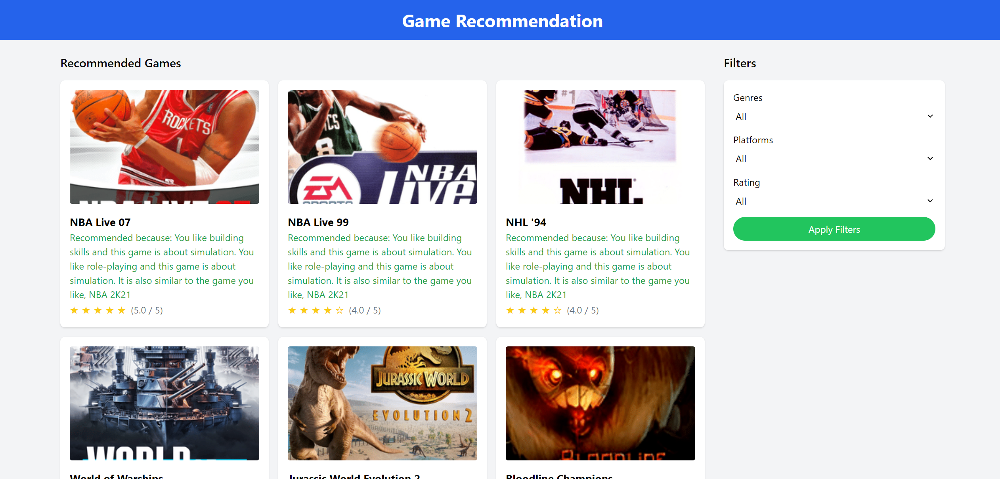

# ADS-final
## How to run
```
# install requirements
pip3 install -r requirements.txt
# start server using port 8888
python3 runserver.py --port 8888
```
Access the website `127.0.0.1:8888` in browser.  
## Website
This is the homepage of the website, where you can select a few games you like and your goals.

After clicking the generate recommendations button, you will be redirected to the recommendation result page, which contains a list of similar games based on your input. You can use filters on the side to find more specific results. The reason/explanation for each recommendation is in green under the game title. If you click the game card, you will be redirected to the game information page on [igdb.com](https://igdb.com/) to see more details about the game.


## Logic
We utilized content-based filtering and the VOTE method together to generate personalized recommendations. We used the IGDB API to construct the dataset.

For the VOTE method, which is implemented in `goal_based.py`, the system assigns a score to each game based on the user's selected goals on the homepage. The VOTE method sorts the list of games and provides a selection of up to 100 games that best satisfy the user's goals. We then employ content-based filtering to further refine the recommendations by considering the user's preferences and game similarities.

For content-based filtering, which implemented in `cb_filter.py`, we computed pairwise cosine similarity scores for all games based on their descriptions. We employed a Natural Language Processing approach to extract features from game descriptions. By calculating Term Frequency-Inverse Document Frequency (TF-IDF) vectors (the number of documents in which a term appears divided by its frequency in those documents), we obtained a 2d matrix with where A_0j is the normalized j'th term (word) frequency in dataset. We then used the linear_kernel() function in sklearn to calculate the similarity scores between pairs of games. By taking a prev_game input from the user, the function can provide a list of similar games to recommend for the user to play.

## Example

When you select "NBA 2K21" as your previous favorite game and select "building skills" and "role-playing" as your goals：


The recommend page will give you the recommendation result:


When you select "League of Legends" as your previous favorite game and "play with friends" as your goal：


The recommend page will give you the recommendation result:


## Literature Review

The literature review is here [here](img/rec_page_2.png) in which we reviewed papers related to our project.